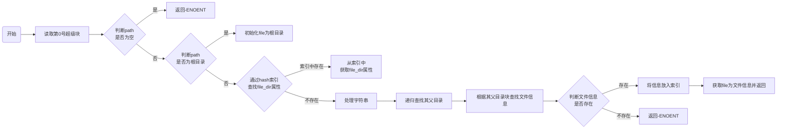
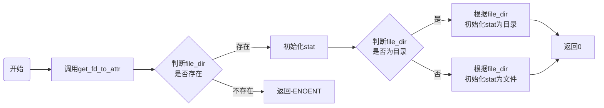
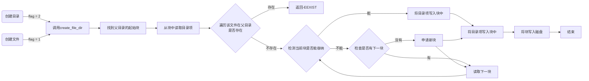
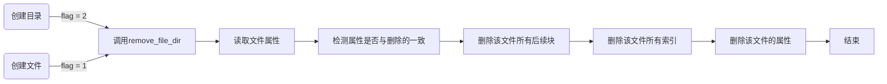
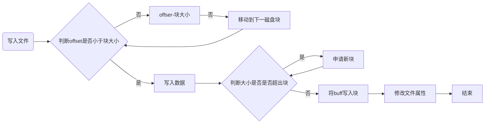
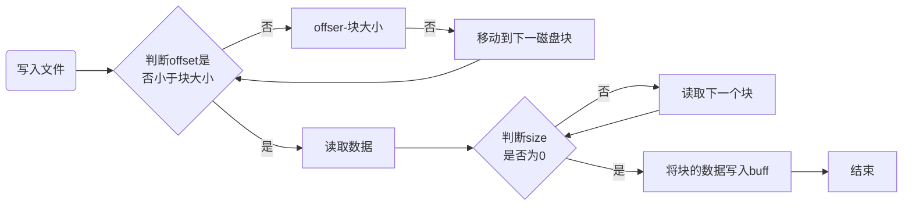

get_fd_to_attr

```mermaid
graph LR
start(开始) --> A[读取第0号超级块]
A --> B{判断path\n是否为空}
B --> |是| C[返回-ENOENT]
B --> |否| D{判断path\n是否为根目录}
D --> |是| E[初始化file为根目录]
D --> |否| F{通过hash索引\n查找file_dir属性}
F --> |索引中存在|G[从索引中\n获取file_dir属性]
F --> |不存在|H[处理字符串]
H --> I[递归查找其父目录]
I --> J[根据其父目录块查找文件信息]
J --> K{判断文件信息\n是否存在}
K --> |存在| L[将信息放入索引]
K --> |不存在| M[返回-ENOENT]
L --> N[获取file为文件信息并返回] 

```

```mermaid
graph LR
start(开始) --> B[调用get_fd_to_attr]
    B --> C{判断file_dir \n是否存在}
    C --> |存在| D[初始化stat]
    C --> |不存在| E[返回-ENOENT]
    D --> F{判断file_dir \n 是否为目录}
    F --> |是| G[根据file_dir \n初始化stat为目录]
    F --> |否| H[根据file_dir \n初始化stat为文件]
    G --> I[返回0]
    H --> I[返回0]
```

```mermaid
graph LR
start1(创建目录) --> |flag = 2| B[调用create_file_dir]
start2(创建文件) -->|flag = 1| B
B --> C[找到父目录的起始块]
C --> D[从块中读取目录项]
D --> E{遍历该文件在父目录\n是否存在}
E --> |存在| F[返回-EEXIST]
E --> |不存在|G{检测当前块是否能容纳}
G --> |能| H[将目录项写入块中]
H --> L
G --> |不能| I{检查是否有下一块}
I --> |有| J[读取下一块]
J --> G
I --> |没有| K[申请新块]
K --> J
K --> L[将目录项写入块中]
L --> M[将块写入磁盘]
M --> N[结束]
```

```mermaid
graph LR
start1(创建目录) --> |flag = 2| B[调用remove_file_dir]
start2(创建文件) -->|flag = 1| B
B --> C[读取文件属性]
C --> D[检测属性是否与删除的一致]
D --> F[删除该文件所有后续块]
F --> G[删除该文件所有索引]
G --> H[删除该文件的属性]
H --> I[结束] 
```

```mermaid
graph LR
start1(写入文件) --> B{判断offset是否小于块大小}
B --> |是|C[写入数据]
B --> |否|D[offser-块大小]
D --> |否|I[移动到下一磁盘块]
I --> B
C --> E{判断大小是否是否超出块}
E --> |是|F[申请新块]
E --> |否|J[将buff写入块]
J --> G[修改文件属性]
F --> E
G --> H[结束]
```

```mermaid
graph LR
start1(写入文件) --> B{判断offset是\n否小于块大小}
B --> |是|C[读取数据]
B --> |否|D[offser-块大小]
D --> |否|I[移动到下一磁盘块]
I --> B
C --> E{判断size\n是否为0}
E --> |否|F[读取下一个块]
E --> |是|J[将块的数据写入buff]
F --> E
J --> H[结束]
```

