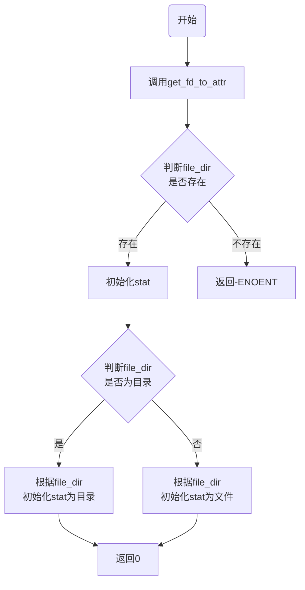

```mermaid
graph TD
start(开始) --> B[调用get_fd_to_attr]
    B --> C{判断file_dir \n是否存在}
    C --> |存在| D[初始化stat]
    C --> |不存在| E[返回-ENOENT]
    D --> F{判断file_dir \n 是否为目录}
    F --> |是| G[根据file_dir \n初始化stat为目录]
    F --> |否| H[根据file_dir \n初始化stat为文件]
    G --> I[返回0]
    H --> I[返回0]
```